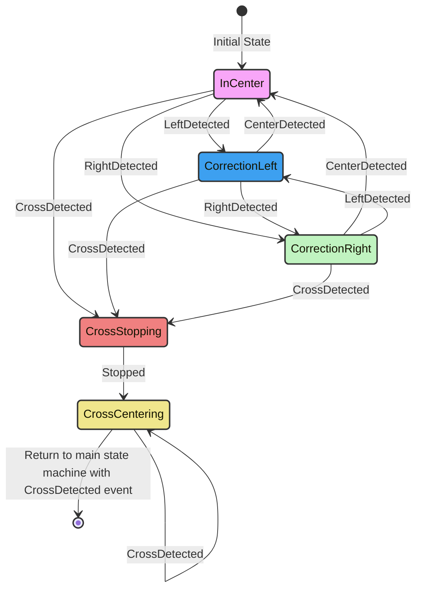

```mermaid
stateDiagram
    [*] --> InCenter: Initial State
    InCenter --> CorrectionLeft: LeftDetected
    InCenter --> CorrectionRight: RightDetected
    InCenter --> CrossStopping: CrossDetected
    CorrectionLeft --> InCenter: CenterDetected
    CorrectionLeft --> CorrectionRight: RightDetected
    CorrectionLeft --> CrossStopping: CrossDetected
    CorrectionRight --> InCenter: CenterDetected
    CorrectionRight --> CorrectionLeft: LeftDetected
    CorrectionRight --> CrossStopping: CrossDetected
    CrossStopping --> CrossCentering: Stopped
    CrossCentering --> CrossCentering: CrossDetected
    CrossCentering --> [*]: Return to main state machine with CrossDetected event

    style InCenter fill:#f8a6f8,stroke:#333,stroke-width:2px
    style CorrectionLeft fill:#3da0f0,stroke:#333,stroke-width:2px
    style CorrectionRight fill:#c0f3c0,stroke:#333,stroke-width:2px
    style CrossStopping fill:#f08080,stroke:#333,stroke-width:2px
    style CrossCentering fill:#f0e68c,stroke:#333,stroke-width:2px
```