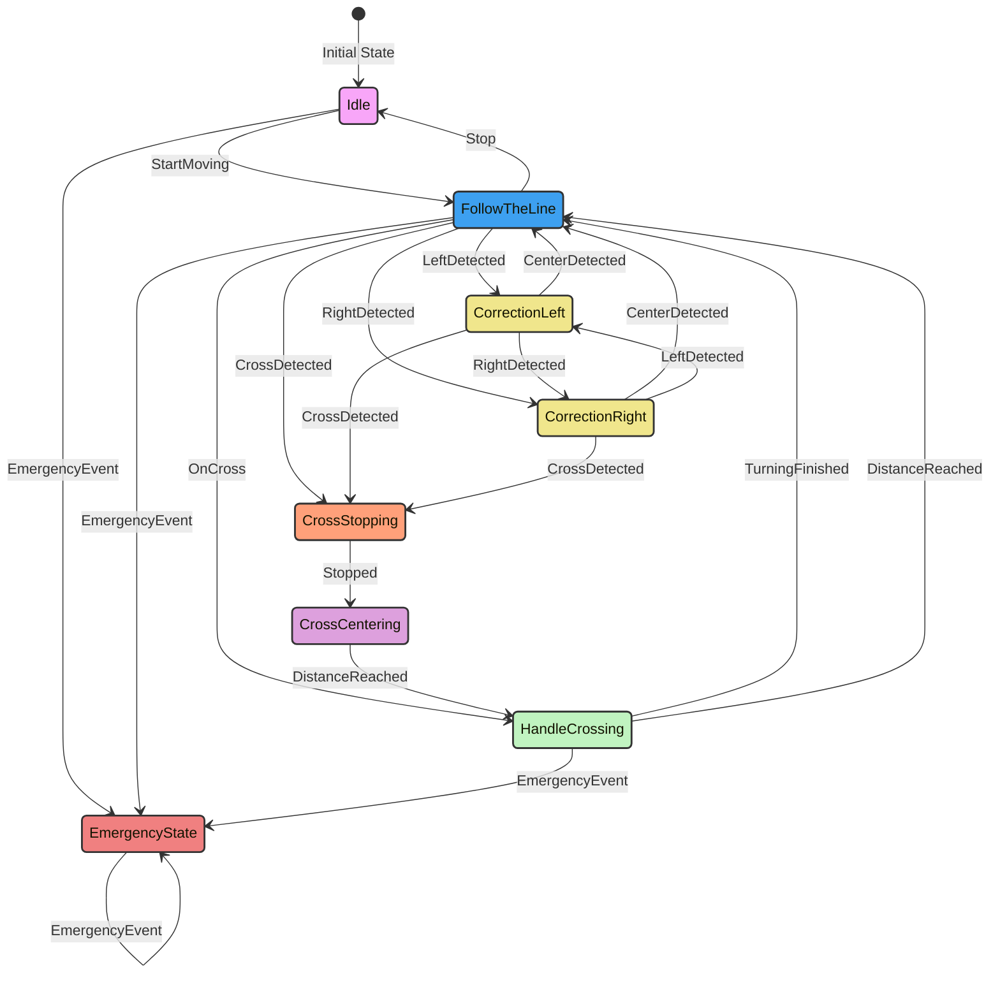

```mermaid
stateDiagram
    [*] --> Idle: Initial State
    Idle --> FollowTheLine: StartMoving
    Idle --> EmergencyState: EmergencyEvent
    state FollowTheLine
    FollowTheLine --> Idle: Stop
    FollowTheLine --> HandleCrossing: OnCross
    FollowTheLine --> EmergencyState: EmergencyEvent
    FollowTheLine --> CorrectionLeft: LeftDetected
    FollowTheLine --> CorrectionRight: RightDetected
    FollowTheLine --> CrossStopping: CrossDetected
    HandleCrossing --> FollowTheLine: TurningFinished
    HandleCrossing --> EmergencyState: EmergencyEvent
    HandleCrossing --> FollowTheLine: DistanceReached
    CorrectionLeft --> FollowTheLine: CenterDetected
    CorrectionLeft --> CorrectionRight: RightDetected
    CorrectionLeft --> CrossStopping: CrossDetected
    CorrectionRight --> FollowTheLine: CenterDetected
    CorrectionRight --> CorrectionLeft: LeftDetected
    CorrectionRight --> CrossStopping: CrossDetected
    CrossStopping --> CrossCentering: Stopped
    CrossCentering --> HandleCrossing: DistanceReached
    EmergencyState --> EmergencyState: EmergencyEvent

    style Idle fill:#f8a6f8,stroke:#333,stroke-width:2px
    style FollowTheLine fill:#3da0f0,stroke:#333,stroke-width:2px
    style HandleCrossing fill:#c0f3c0,stroke:#333,stroke-width:2px
    style CorrectionLeft fill:#f0e68c,stroke:#333,stroke-width:2px
    style CorrectionRight fill:#f0e68c,stroke:#333,stroke-width:2px
    style CrossStopping fill:#ffa07a,stroke:#333,stroke-width:2px
    style CrossCentering fill:#dda0dd,stroke:#333,stroke-width:2px
    style EmergencyState fill:#f08080,stroke:#333,stroke-width:2px
```