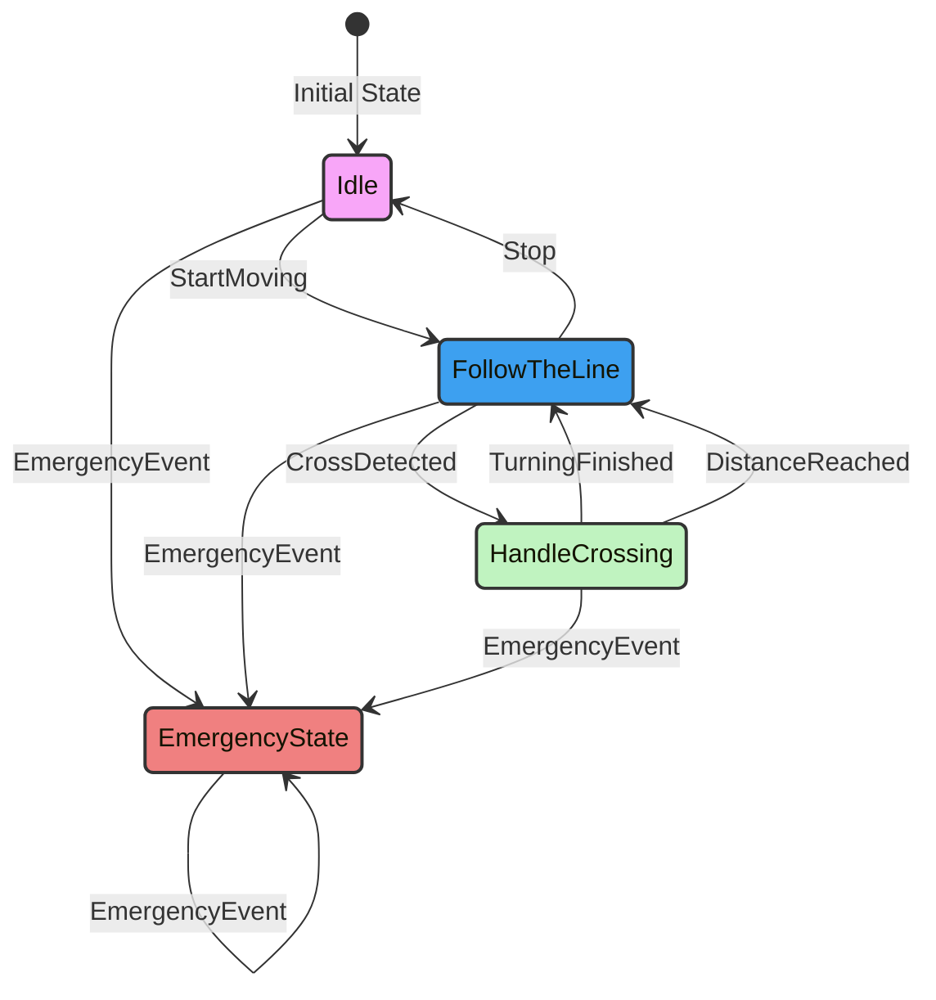

```mermaid
stateDiagram
    [*] --> Idle: Initial State
    Idle --> FollowTheLine: StartMoving
    Idle --> EmergencyState: EmergencyEvent
    state FollowTheLine
    FollowTheLine --> Idle: Stop
    FollowTheLine --> HandleCrossing: CrossDetected
    FollowTheLine --> EmergencyState: EmergencyEvent
    HandleCrossing --> FollowTheLine: TurningFinished
    HandleCrossing --> EmergencyState: EmergencyEvent
    HandleCrossing --> FollowTheLine: DistanceReached
    EmergencyState --> EmergencyState: EmergencyEvent

    style Idle fill:#f8a6f8,stroke:#333,stroke-width:2px
    style FollowTheLine fill:#3da0f0,stroke:#333,stroke-width:2px
    style HandleCrossing fill:#c0f3c0,stroke:#333,stroke-width:2px
    style EmergencyState fill:#f08080,stroke:#333,stroke-width:2px
```