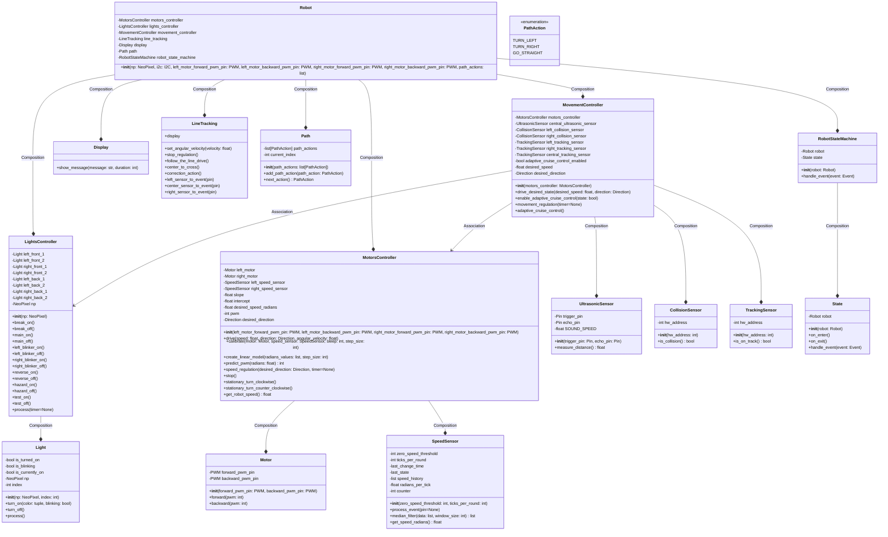

```mermaid
classDiagram
    class Robot {
        -MotorsController motors_controller
        -LightsController lights_controller
        -MovementController movement_controller
        -LineTracking line_tracking
        -Display display
        -Path path
        -RobotStateMachine robot_state_machine

        +__init__(np: NeoPixel, i2c: I2C, left_motor_forward_pwm_pin: PWM, left_motor_backward_pwm_pin: PWM, right_motor_forward_pwm_pin: PWM, right_motor_backward_pwm_pin: PWM, path_actions: list)
    }

    class Light {
        -bool is_turned_on
        -bool is_blinking
        -bool is_currently_on
        -NeoPixel np
        -int index

        +__init__(np: NeoPixel, index: int)
        +turn_on(color: tuple, blinking: bool)
        +turn_off()
        +process()
    }

    class LightsController {
        -Light left_front_1
        -Light left_front_2
        -Light right_front_1
        -Light right_front_2
        -Light left_back_1
        -Light left_back_2
        -Light right_back_1
        -Light right_back_2
        -NeoPixel np

        +__init__(np: NeoPixel)
        +break_on()
        +break_off()
        +main_on()
        +main_off()
        +left_blinker_on()
        +left_blinker_off()
        +right_blinker_on()
        +right_blinker_off()
        +reverse_on()
        +reverse_off()
        +hazard_on()
        +hazard_off()
        +test_on()
        +test_off()
        +process(timer=None)
    }

    class SpeedSensor {
        -int zero_speed_threshold
        -int ticks_per_round
        -last_change_time
        -last_state
        -list speed_history
        -float radians_per_tick
        -int counter

        +__init__(zero_speed_threshold: int, ticks_per_round: int)
        +process_event(pin=None)
        +median_filter(data: list, window_size: int) list
        +get_speed_radians() float
    }

    class Motor {
        -PWM forward_pwm_pin
        -PWM backward_pwm_pin

        +__init__(forward_pwm_pin: PWM, backward_pwm_pin: PWM)
        +forward(pwm: int)
        +backward(pwm: int)
    }

    class MotorsController {
        -Motor left_motor
        -Motor right_motor
        -SpeedSensor left_speed_sensor
        -SpeedSensor right_speed_sensor
        -float slope
        -float intercept
        -float desired_speed_radians
        -int pwm
        -Direction desired_direction

        +__init__(left_motor_forward_pwm_pin: PWM, left_motor_backward_pwm_pin: PWM, right_motor_forward_pwm_pin: PWM, right_motor_backward_pwm_pin: PWM)
        +drive(speed: float, direction: Direction, angular_velocity: float)
        +calibrate(motor: Motor, speed_sensor: SpeedSensor, sleep: int, step_size: int)
        +create_linear_model(radians_values: list, step_size: int)
        +predict_pwm(radians: float) int
        +speed_regulation(desired_direction: Direction, timer=None)
        +stop()
        +stationary_turn_clockwise()
        +stationary_turn_counter_clockwise()
        +get_robot_speed() float
    }

    class UltrasonicSensor {
        -Pin trigger_pin
        -Pin echo_pin
        -float SOUND_SPEED

        +__init__(trigger_pin: Pin, echo_pin: Pin)
        +measure_distance() float
    }

    class CollisionSensor {
        -int hw_address

        +__init__(hw_address: int)
        +is_collision() bool
    }

    class TrackingSensor {
        -int hw_address

        +__init__(hw_address: int)
        +is_on_track() bool
    }

    class MovementController {
        -MotorsController motors_controller
        -UltrasonicSensor central_ultrasonic_sensor
        -CollisionSensor left_collision_sensor
        -CollisionSensor right_collision_sensor
        -TrackingSensor left_tracking_sensor
        -TrackingSensor right_tracking_sensor
        -TrackingSensor central_tracking_sensor
        -bool adaptive_cruise_control_enabled
        -float desired_speed
        -Direction desired_direction

        +__init__(motors_controller: MotorsController)
        +drive_desired_state(desired_speed: float, direction: Direction)
        +enable_adaptive_cruise_control(state: bool)
        +movement_regulation(timer=None)
        +adaptive_cruise_control()
    }

    class Display {
        +show_message(message: str, duration: int)
    }

    class LineTracking {
        +display
        +set_angular_velocity(velocity: float)
        +stop_regulation()
        +follow_the_line_drive()
        +center_to_cross()
        +correction_action()
        +left_sensor_to_event(pin)
        +center_sensor_to_event(pin)
        +right_sensor_to_event(pin)
    }

    class PathAction {
        <<enumeration>>
        TURN_LEFT
        TURN_RIGHT
        GO_STRAIGHT
    }

    class Path {
        -list[PathAction] path_actions
        -int current_index

        +__init__(path_actions: list[PathAction])
        +add_path_action(path_action: PathAction)
        +next_action() PathAction
    }

    class State {
        -Robot robot

        +__init__(robot: Robot)
        +on_enter()
        +on_exit()
        +handle_event(event: Event)
    }

    class RobotStateMachine {
        -Robot robot
        -State state

        +__init__(robot: Robot)
        +handle_event(event: Event)
    }

    Robot --* LightsController : Composition
    Robot --* MotorsController : Composition
    Robot --* MovementController : Composition
    Robot --* LineTracking : Composition
    Robot --* Display : Composition
    Robot --* Path : Composition
    Robot --* RobotStateMachine : Composition
    LightsController --* Light : Composition
    MotorsController --* Motor : Composition
    MotorsController --* SpeedSensor : Composition
    MovementController --* UltrasonicSensor : Composition
    MovementController --* CollisionSensor : Composition
    MovementController --* TrackingSensor : Composition
    MovementController --> MotorsController : Association
    MovementController --> LightsController : Association
    RobotStateMachine --* State : Composition

```